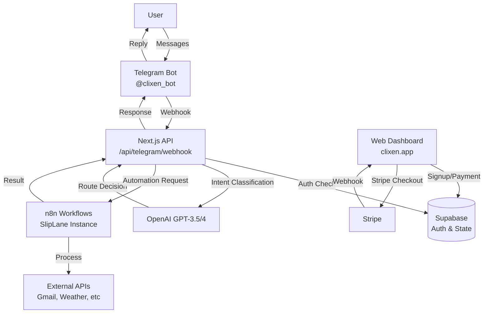

# Clixen AI - Technical Architecture Document

## System Overview

Clixen AI is a Telegram-first automation platform that uses conversational AI to route user requests to pre-built n8n workflows. This document details the technical architecture, data flow, and implementation specifics.

## Core Architecture



## Component Details

### 1. Telegram Bot Layer

**Bot**: @clixen_bot  
**Token**: Stored in `TELEGRAM_BOT_TOKEN` env variable

**Webhook Configuration**:
```javascript
POST https://api.telegram.org/bot{TOKEN}/setWebhook
{
  "url": "https://clixen.app/api/telegram/webhook",
  "allowed_updates": ["message", "callback_query"],
  "drop_pending_updates": true
}
```

**Commands**:
- `/start` - User onboarding and account linking
- `/help` - Display available automations
- `/status` - Show subscription status
- `/feedback` - Collect user feedback

### 2. Next.js API Gateway

**Endpoint**: `/api/telegram/webhook`

**Responsibilities**:
1. Receive Telegram updates
2. Verify user authentication
3. Check subscription/trial status
4. Classify intent using AI
5. Route to appropriate handler
6. Return response to Telegram

**Request Flow**:
```typescript
interface WebhookFlow {
  1. "Receive Update" -> Validate Telegram signature
  2. "Check User" -> Query Supabase for profile
  3. "Verify Access" -> Check trial/subscription status
  4. "Classify Intent" -> Call OpenAI API
  5. "Route Request" -> Direct response OR n8n workflow
  6. "Send Response" -> Telegram sendMessage API
}
```

### 3. AI Intent Router

**Model**: GPT-3.5-turbo (cost-effective) or GPT-4 (complex queries)

**System Prompt Structure**:
```javascript
const SYSTEM_PROMPT = `
You are Clixen AI assistant. Classify user intent and extract parameters.

AVAILABLE WORKFLOWS:
1. weather - needs: {city}
2. email_scan - needs: {keywords, provider}
3. pdf_summary - needs: {file_attachment}
4. translate - needs: {text, target_language}

ROUTING RULES:
- Match to workflow -> return action:"route_to_n8n"
- Need clarification -> return action:"need_clarification"
- Direct answer -> return action:"direct_response"

Return JSON: {action, workflow, parameters, response}
`;
```

**Classification Logic**:
```typescript
async function classifyIntent(message: string): Promise<AIDecision> {
  const completion = await openai.chat.completions.create({
    model: 'gpt-3.5-turbo',
    messages: [
      { role: 'system', content: SYSTEM_PROMPT },
      { role: 'user', content: message }
    ],
    response_format: { type: 'json_object' },
    temperature: 0.3,
    max_tokens: 200
  });
  
  return JSON.parse(completion.choices[0].message.content);
}
```

### 4. n8n Workflow Engine

**Instance**: https://n8nio-n8n-7xzf6n.sliplane.app  
**Authentication**: API Key in headers

**Webhook Endpoints**:
- `/webhook/api/v1/weather`
- `/webhook/api/v1/email-scan`
- `/webhook/api/v1/pdf-summary`
- `/webhook/api/v1/translate`

**Workflow Structure**:
```json
{
  "nodes": [
    {
      "name": "Webhook",
      "type": "n8n-nodes-base.webhook",
      "parameters": {
        "path": "api/v1/{workflow}",
        "method": "POST"
      }
    },
    {
      "name": "Process",
      "type": "n8n-nodes-base.function",
      "parameters": {
        "code": "// Business logic here"
      }
    },
    {
      "name": "Respond",
      "type": "n8n-nodes-base.respondToWebhook",
      "parameters": {
        "responseBody": "{ message: result }"
      }
    }
  ]
}
```

### 5. Database Schema (Supabase)

**Minimal State Storage** - No message content stored

```sql
-- User profiles with trial/subscription
CREATE TABLE profiles (
  id UUID PRIMARY KEY DEFAULT gen_random_uuid(),
  email TEXT UNIQUE NOT NULL,
  telegram_chat_id TEXT UNIQUE,
  tier TEXT DEFAULT 'free',
  trial_started_at TIMESTAMPTZ DEFAULT NOW(),
  trial_expires_at TIMESTAMPTZ DEFAULT NOW() + INTERVAL '7 days',
  trial_active BOOLEAN DEFAULT true,
  stripe_customer_id TEXT,
  stripe_subscription_id TEXT,
  created_at TIMESTAMPTZ DEFAULT NOW(),
  updated_at TIMESTAMPTZ DEFAULT NOW()
);

-- Usage tracking (no message content)
CREATE TABLE usage_logs (
  id BIGSERIAL PRIMARY KEY,
  user_id UUID REFERENCES profiles(id),
  action TEXT NOT NULL, -- 'weather', 'email_scan', etc
  telegram_message_id BIGINT,
  success BOOLEAN DEFAULT true,
  created_at TIMESTAMPTZ DEFAULT NOW()
);

-- Temporary context for multi-step workflows
CREATE TABLE conversation_context (
  user_id UUID REFERENCES profiles(id),
  context JSONB,
  expires_at TIMESTAMPTZ DEFAULT NOW() + INTERVAL '1 hour',
  PRIMARY KEY (user_id)
);
```

### 6. Payment Integration (Stripe)

**Products**:
- Starter: $9/month (price_starter_monthly)
- Pro: $49/month (price_pro_monthly)

**Webhook Events**:
- `checkout.session.completed` - Activate subscription
- `customer.subscription.updated` - Update tier
- `customer.subscription.deleted` - Downgrade to free

**Flow**:
1. User clicks "Subscribe" on dashboard
2. Create Stripe checkout session
3. Redirect to Stripe
4. Handle webhook on completion
5. Update user profile tier

## Security Considerations

### 1. Telegram Webhook Security
```typescript
function verifyTelegramWebhook(req: Request): boolean {
  const secret = crypto
    .createHash('sha256')
    .update(BOT_TOKEN)
    .digest();
    
  const signature = req.headers['x-telegram-bot-api-secret-token'];
  return crypto.timingSafeEqual(secret, signature);
}
```

### 2. Rate Limiting
```typescript
const rateLimits = {
  free: { requests: 10, window: '1h' },
  starter: { requests: 100, window: '1h' },
  pro: { requests: 1000, window: '1h' }
};
```

### 3. API Authentication
- n8n: API Key in `X-API-Key` header
- OpenAI: Bearer token
- Stripe: Webhook signature verification

## Deployment Architecture

### Production Setup:
```yaml
Frontend (Next.js):
  - Host: Vercel or Hostinger
  - Domain: clixen.app
  - SSL: Auto-provisioned

Bot Webhook:
  - Endpoint: https://clixen.app/api/telegram/webhook
  - Method: POST
  - Validation: Telegram signature

n8n Instance:
  - Host: SlipLane
  - URL: https://n8nio-n8n-7xzf6n.sliplane.app
  - Auth: API Key

Database:
  - Provider: Supabase
  - Region: US East
  - Backup: Daily automatic
```

### Environment Variables:
```env
# Telegram
TELEGRAM_BOT_TOKEN=
TELEGRAM_BOT_USERNAME=clixen_bot

# n8n
N8N_API_KEY=
N8N_WEBHOOK_URL=https://n8nio-n8n-7xzf6n.sliplane.app

# AI
OPENAI_API_KEY=

# Database
SUPABASE_URL=
SUPABASE_ANON_KEY=
SUPABASE_SERVICE_ROLE_KEY=
DATABASE_URL=

# Payments
STRIPE_SECRET_KEY=
STRIPE_WEBHOOK_SECRET=
NEXT_PUBLIC_STRIPE_PUBLISHABLE_KEY=

# App
NEXT_PUBLIC_APP_URL=https://clixen.app
```

## Performance Optimization

### 1. Caching Strategy
- Cache AI classifications for similar messages (1 hour TTL)
- Cache user profile data (5 minutes TTL)
- Cache n8n workflow results when appropriate

### 2. Async Processing
- Use Telegram's typing indicator for long operations
- Queue heavy workflows for background processing
- Implement retry logic with exponential backoff

### 3. Database Optimization
- Index on `telegram_chat_id` for fast lookups
- Automatic cleanup of expired context
- Connection pooling via Supabase

## Monitoring & Observability

### Key Metrics:
- Webhook response time
- AI classification accuracy
- n8n workflow success rate
- User engagement (messages/day)
- Trial to paid conversion

### Logging:
```typescript
console.log({
  timestamp: new Date().toISOString(),
  user_id: profile.id,
  action: decision.workflow,
  success: result.success,
  duration_ms: Date.now() - startTime
});
```

### Error Handling:
- Graceful fallbacks for all external services
- User-friendly error messages
- Admin alerts for critical failures

## Scaling Considerations

### Current Limits:
- 50 beta users
- 1,000 requests/day
- Single n8n instance

### Scale Strategy:
1. **100 users**: Current architecture sufficient
2. **1,000 users**: Add Redis cache, multiple n8n workers
3. **10,000 users**: Kubernetes deployment, load balancing
4. **100,000 users**: Multi-region, custom workflow engine

## Development Workflow

### Local Development:
```bash
# 1. Start Next.js
npm run dev

# 2. Expose via ngrok
ngrok http 3000

# 3. Update Telegram webhook
curl -X POST https://api.telegram.org/bot{TOKEN}/setWebhook \
  -d "url=https://xxx.ngrok.io/api/telegram/webhook"

# 4. Test with Telegram
```

### CI/CD Pipeline:
1. Push to main branch
2. Run tests
3. Deploy to Vercel/Hostinger
4. Update Telegram webhook
5. Smoke test core workflows

## Troubleshooting Guide

### Common Issues:

**1. Webhook not receiving messages**
- Check webhook URL is correct
- Verify SSL certificate
- Check Telegram getWebhookInfo

**2. AI classification failing**
- Verify OpenAI API key
- Check rate limits
- Review system prompt

**3. n8n workflows timing out**
- Check SlipLane instance status
- Verify API key
- Review workflow logs

**4. User can't access bot**
- Check Supabase profile exists
- Verify trial/subscription status
- Check Telegram chat_id linking

---

This architecture is designed for simplicity, scalability, and privacy. The system can handle 50-100 concurrent users with minimal infrastructure while maintaining sub-second response times for most operations.