# Complete MCP-Based N8N Workflow Orchestration

## 🎯 Overview

This is a **comprehensive MCP-powered orchestration system** that uses:
- **czlonkowski n8n-mcp** for ALL workflow operations
- **Prisma MCP** for enhanced database queries
- **Firecrawl MCP** for web scraping capabilities

The system follows a complete pipeline where **n8n-mcp handles everything** from intent parsing to error fixing.

## 🔄 Complete Pipeline Flow

```mermaid
graph TD
    A[User Intent] --> B[n8n-MCP: Parse Intent]
    B --> C[n8n-MCP: Discover Nodes]
    C --> D[Create Workflow JSON]
    D --> E[n8n-MCP: Validate JSON]
    E --> F{Valid?}
    F -->|No| G[n8n-MCP: Heal Workflow]
    G --> E
    F -->|Yes| H[Deploy to n8n]
    H --> I[Activate & Test]
    I --> J{Errors?}
    J -->|Yes| K[n8n-MCP: Identify Error Node]
    K --> L[n8n-MCP: Fix Node Error]
    L --> M[Redeploy]
    M --> I
    J -->|No| N[✅ Success]
```



## 🚀 Installation & Setup

### 1. Install Dependencies

```bash
npm install
npm run prisma-generate
```

### 2. Configure Environment

```bash
cp .env.example .env
```

Edit `.env`:
```env
# n8n Instance
N8N_API_KEY=your_api_key
N8N_BASE_URL=https://your-instance.n8n.cloud

# MCP Configuration
N8N_MCP_MODE=stdio
N8N_MCP_LOG_LEVEL=info

# Firecrawl (optional)
FIRECRAWL_API_KEY=your_firecrawl_key
```

### 3. Clean n8n Instance (Start Fresh)

```bash
npm run clean-instance
# or
npm run mcp-clean
```

This will **delete all existing workflows** from your n8n instance.

## 📝 Usage

### Basic Workflow Creation

```bash
npm run mcp-create -- \
  --intent "send email notification when webhook receives data" \
  --name "WebhookEmailNotifier"
```

### With Activation

```bash
npm run mcp-create -- \
  --intent "monitor RSS feed and post to Slack" \
  --name "RSSSlackBot" \
  --activate
```

### With Web Scraping

```bash
npm run mcp-create -- \
  --intent "scrape https://example.com daily and save to database" \
  --name "DailyScraper" \
  --activate
```

## 🔍 Pipeline Steps Explained

### Step 1: Intent Parsing (n8n-MCP)

The system sends your intent to n8n-MCP which:
- Extracts keywords
- Identifies workflow categories
- Determines required node types
- Suggests workflow structure

**MCP Command**: `PARSE_INTENT`

### Step 2: Node Discovery (n8n-MCP)

Based on parsed intent, n8n-MCP:
- Searches its 535+ node database
- Returns relevant nodes with details
- Provides node configurations
- Suggests connections

**MCP Command**: `SUGGEST_NODES`

### Step 3: JSON Creation

The system creates workflow JSON with:
- Proper node positioning
- Default parameters
- Intelligent connections
- Trigger node prioritization

### Step 4: Validation & Healing (n8n-MCP)

Before deployment, n8n-MCP:
- Validates workflow structure
- Checks node compatibility
- Fixes common issues
- Ensures n8n compatibility

**MCP Commands**: `VALIDATE_WORKFLOW`, `HEAL_WORKFLOW`

### Step 5: Deployment

The validated workflow is:
- Deployed via n8n API
- Optionally activated
- Ready for execution

### Step 6: Error Detection & Fixing (n8n-MCP)

If execution fails:
1. System identifies the problematic node
2. Sends error details to n8n-MCP
3. n8n-MCP suggests fixes
4. System applies fixes and retests

**MCP Command**: `FIX_NODE_ERROR`

## 🛠️ Advanced Features

### Firecrawl Integration

When intent mentions web scraping:
```bash
npm run mcp-create -- \
  --intent "scrape product prices from https://shop.example.com" \
  --name "PriceScraper"
```

Firecrawl automatically:
- Extracts URLs from intent
- Scrapes web content
- Provides data for workflow

### Prisma Database Queries

The system uses Prisma for:
- Fast node searches
- Category filtering
- Template discovery
- Fallback operations

### MCP Communication

Direct communication with n8n-mcp process:
```javascript
// Send command to MCP
await sendToMcp('SEARCH_NODES', {
  keywords: ['email', 'notification'],
  categories: ['communication']
});
```

## 🔧 Error Handling

### Automatic Error Recovery

When a workflow fails, the system:

1. **Identifies Error Source**
   - Parses error messages
   - Locates problematic node
   - Extracts error context

2. **Requests Fix from n8n-MCP**
   ```javascript
   await sendToMcp('FIX_NODE_ERROR', {
     workflow: currentWorkflow,
     errorNode: 'HTTP_Request_0',
     error: 'Invalid URL format'
   });
   ```

3. **Applies Fix**
   - Updates workflow configuration
   - Redeploys to n8n
   - Retests execution

### Manual Intervention

If automatic fixing fails:
- System logs detailed error info
- Suggests manual fixes
- Provides node documentation links

## 📊 Example Workflows

### 1. Email Notification System

```bash
npm run mcp-create -- \
  --intent "receive form submissions via webhook and send email notifications" \
  --name "FormEmailer" \
  --activate
```

**Generated Nodes**:
- Webhook Trigger
- Data Validation
- Email Send
- Response

### 2. Data Processing Pipeline

```bash
npm run mcp-create -- \
  --intent "fetch CSV from FTP daily, process data, store in PostgreSQL" \
  --name "DataPipeline" \
  --activate
```

**Generated Nodes**:
- Schedule Trigger
- FTP Download
- CSV Parser
- Data Transform
- PostgreSQL Insert

### 3. Social Media Automation

```bash
npm run mcp-create -- \
  --intent "monitor RSS feeds and post updates to Twitter and Discord" \
  --name "SocialBot" \
  --activate
```

**Generated Nodes**:
- RSS Feed Trigger
- Content Filter
- Twitter Post
- Discord Message

## 🐛 Troubleshooting

### MCP Communication Issues

```bash
# Check MCP process
ps aux | grep n8n-mcp

# Test MCP directly
npx n8n-mcp --test

# Enable debug logging
N8N_MCP_LOG_LEVEL=debug npm run mcp-create -- --intent "test"
```

### Database Connection

```bash
# Verify Prisma connection
npx prisma studio

# Check database
sqlite3 node_modules/n8n-mcp/data/nodes.db ".tables"
```

### API Errors

```bash
# Test n8n API
curl -H "X-N8N-API-KEY: $N8N_API_KEY" \
  $N8N_BASE_URL/api/v1/workflows
```

## 🔄 Workflow Lifecycle

```
1. Intent → MCP parsing
2. Nodes → MCP discovery
3. JSON → Local creation
4. Validation → MCP checking
5. Healing → MCP fixing
6. Deploy → n8n API
7. Test → Execution
8. Error? → MCP analysis
9. Fix → MCP suggestion
10. Success → Active workflow
```

## 📈 Performance

- **Intent Parsing**: ~500ms
- **Node Discovery**: ~1s
- **JSON Creation**: ~100ms
- **Validation**: ~500ms
- **Deployment**: ~2s
- **Total Pipeline**: ~4-5s

## 🎯 Best Practices

1. **Clear Intents**: Be specific about workflow requirements
2. **Test First**: Always test before activating
3. **Monitor Errors**: Check execution logs
4. **Use Templates**: Leverage existing workflows
5. **Web Scraping**: Include URLs in intent

## 🔗 Resources

- [n8n-mcp GitHub](https://github.com/czlonkowski/n8n-mcp)
- [Firecrawl Docs](https://docs.firecrawl.dev)
- [n8n API Docs](https://docs.n8n.io/api/)
- [Prisma Docs](https://www.prisma.io/docs)

## 📝 Commands Reference

```bash
# Create workflow
npm run mcp-create -- -i "intent" -n "name" [-a]

# Clean instance
npm run clean-instance

# Search nodes
npm run search-nodes -- -q "query"

# Validate intent
npm run prisma-validate-intent -- -i "intent"
```

## 🚨 Important Notes

- **Deletion Warning**: `clean-instance` deletes ALL workflows
- **API Limits**: Respect n8n API rate limits
- **MCP Process**: Runs as subprocess, auto-cleanup on exit
- **Error Recovery**: Max 3 retry attempts
- **Web Scraping**: Requires Firecrawl API key

---

*Built with ❤️ using czlonkowski/n8n-mcp, Prisma, and Firecrawl*