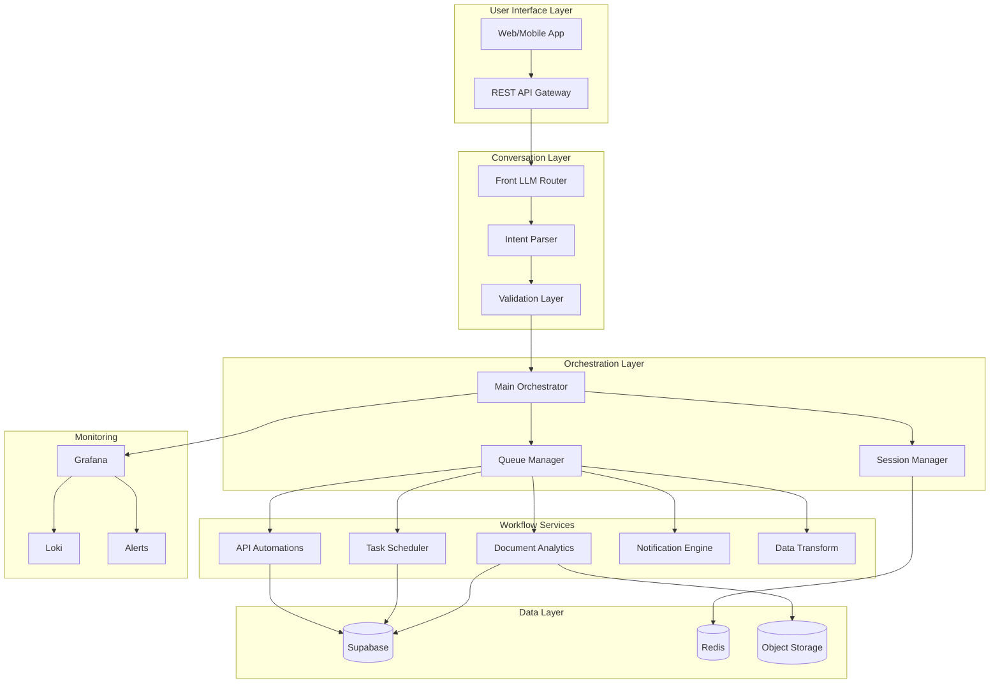

# B2C Automation Platform - Technical Architecture

## System Overview



## Document Analytics Service Architecture

### Workflow Components

```
┌─────────────────────────────────────────────────────────┐
│                 DOCUMENT ANALYTICS WORKFLOW              │
├─────────────────────────────────────────────────────────┤
│                                                          │
│  1. FILE INGESTION                                      │
│     ├─ Webhook Trigger (receives file)                  │
│     ├─ File Validation (type, size, virus scan)         │
│     └─ Store in Supabase Storage                        │
│                                                          │
│  2. DOCUMENT PROCESSING                                 │
│     ├─ Extract Text (PDF/Word/Excel)                    │
│     ├─ Parse Structured Data                            │
│     └─ Clean & Normalize                                │
│                                                          │
│  3. ANALYTICS ENGINE                                    │
│     ├─ Statistical Analysis                             │
│     │   ├─ Descriptive Stats                           │
│     │   ├─ Correlations                                │
│     │   └─ Trends                                      │
│     ├─ AI Insights (GPT-4)                             │
│     └─ Anomaly Detection                               │
│                                                          │
│  4. VISUALIZATION                                       │
│     ├─ Chart Generation (Chart.js)                      │
│     ├─ Graph Creation                                   │
│     └─ Dashboard Assembly                               │
│                                                          │
│  5. REPORT GENERATION                                   │
│     ├─ PDF Report Builder                               │
│     ├─ PPT Presentation Creator                         │
│     └─ Excel Summary Export                             │
│                                                          │
│  6. DELIVERY                                            │
│     ├─ Email with Attachments                           │
│     ├─ Download Links                                   │
│     └─ Webhook Callbacks                                │
│                                                          │
└─────────────────────────────────────────────────────────┘
```

### Data Flow

```yaml
Input:
  trigger: webhook
  payload:
    user_id: string
    file_url: string
    file_type: pdf|csv|xlsx|docx
    analysis_type: 
      - statistical
      - trends
      - insights
      - anomalies
    output_format:
      - pdf
      - ppt
      - email
    delivery:
      email: string
      webhook: string (optional)

Processing:
  1. File Download & Validation
  2. Content Extraction
  3. Data Analysis
  4. Visualization Generation
  5. Report Creation
  6. Delivery

Output:
  success:
    report_url: string
    charts: array
    insights: object
    delivery_status: string
  error:
    code: string
    message: string
    details: object
```

## Main Orchestrator Workflow

```yaml
name: Main Orchestrator
trigger: webhook
nodes:
  - id: receive_request
    type: webhook
    config:
      path: /api/orchestrate
      method: POST
      
  - id: validate_user
    type: code
    description: Check auth & rate limits
    
  - id: parse_intent
    type: ai_agent
    description: Determine workflow to execute
    
  - id: session_check
    type: supabase
    description: Get/create user session
    
  - id: route_decision
    type: switch
    routes:
      - condition: intent == 'document_analytics'
        target: document_analytics_workflow
      - condition: intent == 'schedule_task'
        target: task_scheduler_workflow
      - condition: intent == 'api_automation'
        target: api_automation_workflow
      - default: error_handler
        
  - id: queue_heavy_task
    type: redis
    description: Queue for async processing
    
  - id: return_response
    type: respond_webhook
    description: Return job ID or result
```

## Database Schema

### Core Tables

```sql
-- Users & Authentication
CREATE TABLE users (
    id UUID PRIMARY KEY DEFAULT uuid_generate_v4(),
    email VARCHAR(255) UNIQUE NOT NULL,
    name VARCHAR(255),
    tier VARCHAR(50) DEFAULT 'free',
    api_key VARCHAR(255) UNIQUE,
    created_at TIMESTAMP DEFAULT NOW(),
    metadata JSONB
);

-- Sessions
CREATE TABLE sessions (
    id UUID PRIMARY KEY DEFAULT uuid_generate_v4(),
    user_id UUID REFERENCES users(id),
    context JSONB,
    last_activity TIMESTAMP DEFAULT NOW(),
    expires_at TIMESTAMP
);

-- Workflow Executions
CREATE TABLE executions (
    id UUID PRIMARY KEY DEFAULT uuid_generate_v4(),
    user_id UUID REFERENCES users(id),
    workflow_type VARCHAR(100),
    status VARCHAR(50),
    input_data JSONB,
    output_data JSONB,
    error JSONB,
    started_at TIMESTAMP DEFAULT NOW(),
    completed_at TIMESTAMP,
    duration_ms INTEGER
);

-- Document Analytics Jobs
CREATE TABLE analytics_jobs (
    id UUID PRIMARY KEY DEFAULT uuid_generate_v4(),
    execution_id UUID REFERENCES executions(id),
    user_id UUID REFERENCES users(id),
    file_url TEXT,
    file_type VARCHAR(50),
    file_size_bytes BIGINT,
    analysis_type TEXT[],
    results JSONB,
    charts JSONB,
    report_url TEXT,
    created_at TIMESTAMP DEFAULT NOW()
);

-- Scheduled Tasks
CREATE TABLE scheduled_tasks (
    id UUID PRIMARY KEY DEFAULT uuid_generate_v4(),
    user_id UUID REFERENCES users(id),
    workflow_id VARCHAR(255),
    cron_expression VARCHAR(100),
    payload JSONB,
    next_run TIMESTAMP,
    last_run TIMESTAMP,
    active BOOLEAN DEFAULT true,
    created_at TIMESTAMP DEFAULT NOW()
);

-- Usage Metrics
CREATE TABLE usage_metrics (
    id UUID PRIMARY KEY DEFAULT uuid_generate_v4(),
    user_id UUID REFERENCES users(id),
    metric_type VARCHAR(100),
    value NUMERIC,
    timestamp TIMESTAMP DEFAULT NOW(),
    metadata JSONB
);
```

## API Specification

### Document Analytics Endpoint

```typescript
// POST /api/analytics/document
interface DocumentAnalyticsRequest {
  file: File | string; // File upload or URL
  analysis: {
    statistical: boolean;
    trends: boolean;
    insights: boolean;
    anomalies: boolean;
  };
  output: {
    format: 'pdf' | 'ppt' | 'excel';
    delivery: 'email' | 'download' | 'webhook';
    email?: string;
    webhook_url?: string;
  };
}

interface DocumentAnalyticsResponse {
  job_id: string;
  status: 'queued' | 'processing' | 'completed' | 'failed';
  estimated_time: number; // seconds
  result_url?: string;
  error?: {
    code: string;
    message: string;
  };
}
```

### Rate Limiting

```yaml
free_tier:
  requests_per_day: 100
  file_size_mb: 10
  processing_time_seconds: 60
  
pro_tier:
  requests_per_day: 1000
  file_size_mb: 100
  processing_time_seconds: 300
  
enterprise:
  requests_per_day: unlimited
  file_size_mb: 500
  processing_time_seconds: unlimited
```

## Security Considerations

1. **File Validation**
   - Virus scanning with ClamAV
   - File type verification
   - Size limits enforcement
   - Sandboxed processing

2. **Data Protection**
   - Encryption at rest
   - TLS for all transfers
   - Temporary file cleanup
   - GDPR compliance

3. **Access Control**
   - JWT authentication
   - API key management
   - Role-based permissions
   - Audit logging

## Performance Targets

| Metric | Target | Alert Threshold |
|--------|--------|-----------------|
| File Processing | <30s for 10MB | >60s |
| API Response | <500ms p95 | >1s |
| Success Rate | >99% | <95% |
| Concurrent Jobs | 100 | >150 |
| Queue Depth | <1000 | >5000 |

## Monitoring & Observability

### Key Metrics
- Workflow execution time by type
- File processing success/failure rate
- API endpoint latency
- Queue depth and processing rate
- User tier distribution
- Storage usage per user

### Alerts
- Processing failure rate >5%
- Queue backup >1000 items
- Storage >80% capacity
- API errors >1%
- Long-running jobs >5 minutes

## Deployment Strategy

### Phase 1: MVP (n8n Cloud)
- Single n8n instance
- Supabase free tier
- Basic monitoring
- 50 beta users

### Phase 2: Growth (n8n Cloud Pro)
- Scaled n8n workers
- Supabase Pro
- Grafana monitoring
- 500 users

### Phase 3: Scale (Hetzner)
- Self-hosted n8n cluster
- Redis queue mode
- Horizontal scaling
- 2000+ users