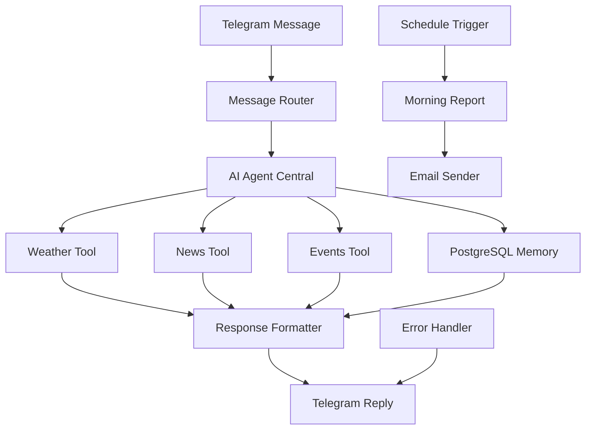

# 🤖 Telegram AI Agent Workflow Documentation

## Overview

This is a comprehensive n8n workflow that creates an intelligent Telegram bot with AI capabilities, featuring:
- **AI Agent Node** at the center for intelligent processing
- **Weather, News, and Events** data fetching
- **PostgreSQL** for conversation memory
- **Scheduled email reports** every morning
- **Multi-tool integration** for comprehensive responses

## 🏗️ Architecture



## 📦 Components

### 1. **Telegram Trigger** 
- Receives messages from users
- Handles both new and edited messages
- Extracts user ID, chat ID, and message text

### 2. **Message Router (Switch Node)**
- Analyzes user intent
- Routes to appropriate tools based on keywords:
  - "weather" → Weather Tool
  - "news" → News Tool
  - "events" → Events Tool

### 3. **AI Agent Central** 🧠
The heart of the workflow with:
- **OpenAI Integration** for natural language understanding
- **Intent Analysis** to understand user requests
- **Location Extraction** (defaults to Everett, MA)
- **Email Detection** for subscription setup
- **Context Management** for personalized responses

**System Prompt:**
```
You are integrated with weather, news, and events APIs. 
You can also schedule daily email reports.
Always be helpful and provide accurate, timely information.
Store user preferences in memory for personalization.
```

### 4. **Weather Tool** 🌤️
- Uses OpenWeatherMap API
- Fetches current weather for specified location
- Returns temperature, conditions, humidity
- Imperial units (Fahrenheit)

### 5. **News Tool** 📰
- Uses NewsAPI for latest news
- Filters by location
- Returns top 5 articles from last 24 hours
- Sorted by publication date

### 6. **Events Tool** 📅
- Uses SerpAPI Google Events
- Searches for local events happening today
- Returns event titles, times, and locations

### 7. **PostgreSQL Memory** 🗄️
Stores:
- User ID and Chat ID
- User preferences (JSON)
- Last requested location
- Email address for reports
- Last request for context
- Timestamps

### 8. **Response Formatter** 
JavaScript code node that:
- Combines data from all tools
- Formats responses in Markdown
- Creates structured, readable messages
- Handles multiple data types

### 9. **Telegram Reply**
- Sends formatted response back to user
- Supports Markdown formatting
- Includes links and structured data

### 10. **Schedule Trigger** ⏰
- Runs daily at 8 AM
- Triggers morning report generation
- Uses cron expression: `0 8 * * *`

### 11. **Morning Report Generator**
- Queries PostgreSQL for users with email
- Fetches weather, news, events for each user's location
- Generates personalized HTML emails

### 12. **Email Sender** 📧
- Sends HTML formatted daily reports
- Beautiful responsive email template
- Includes all requested information

## 💾 PostgreSQL Schema

```sql
CREATE TABLE telegram_user_memory (
  id SERIAL PRIMARY KEY,
  user_id BIGINT UNIQUE NOT NULL,
  chat_id BIGINT NOT NULL,
  preferences JSONB DEFAULT '{}',
  last_location VARCHAR(255) DEFAULT 'Everett, MA',
  email VARCHAR(255),
  last_request TEXT,
  created_at TIMESTAMP DEFAULT CURRENT_TIMESTAMP,
  updated_at TIMESTAMP DEFAULT CURRENT_TIMESTAMP
);
```

## 🔑 Required Credentials

### 1. **Telegram Bot**
```env
TELEGRAM_BOT_TOKEN=your_bot_token_from_botfather
```

### 2. **OpenAI**
```env
OPENAI_API_KEY=your_openai_api_key
```

### 3. **OpenWeatherMap**
```env
OPENWEATHER_API_KEY=your_weather_api_key
```

### 4. **NewsAPI**
```env
NEWS_API_KEY=your_news_api_key
```

### 5. **SerpAPI**
```env
SERP_API_KEY=your_serp_api_key
```

### 6. **PostgreSQL**
```env
POSTGRES_HOST=your_db_host
POSTGRES_PORT=5432
POSTGRES_DB=your_database
POSTGRES_USER=your_username
POSTGRES_PASSWORD=your_password
```

### 7. **SMTP (for emails)**
```env
SMTP_HOST=smtp.gmail.com
SMTP_PORT=587
SMTP_USER=your_email@gmail.com
SMTP_PASS=your_app_password
SMTP_FROM_EMAIL=your_email@gmail.com
```

## 📱 User Interactions

### Example Commands

1. **Weather Request:**
   ```
   User: "What's the weather in Boston?"
   Bot: 🌤 Weather in Boston
        Temperature: 72°F
        Feels like: 70°F
        Conditions: partly cloudy
        Humidity: 65%
   ```

2. **News Request:**
   ```
   User: "Show me news from Everett"
   Bot: 📰 Top News
        1. Local Development Project Approved
           https://example.com/article1
        2. Community Event This Weekend
           https://example.com/article2
   ```

3. **Events Request:**
   ```
   User: "What events are happening today in Everett?"
   Bot: 📅 Today's Events
        1. Farmers Market
           When: 9 AM - 2 PM
           Where: Everett Square
        2. Live Music at City Hall
           When: 6 PM
           Where: City Hall Plaza
   ```

4. **Email Setup:**
   ```
   User: "Send me daily updates to john@gmail.com"
   Bot: ✅ Daily reports will be sent to: john@gmail.com
        You'll receive weather, news, and events every morning at 8 AM.
   ```

## 🎯 Features

### Intelligent Processing
- Natural language understanding
- Context-aware responses
- Location extraction from messages
- Email detection and validation

### Memory & Personalization
- Remembers user preferences
- Stores last location
- Tracks conversation history
- Personalizes responses

### Multi-Source Data
- Real-time weather data
- Latest news articles
- Today's local events
- Combined in single response

### Scheduled Reports
- Daily morning emails at 8 AM
- HTML formatted for readability
- Personalized content
- Unsubscribe option

### Error Handling
- Graceful API failures
- User-friendly error messages
- Fallback responses
- Error logging

## 🚀 Setup Instructions

### 1. Deploy Workflow
```bash
node scripts/create-telegram-agent-workflow.js
```

### 2. Create PostgreSQL Database
Run the provided SQL schema in your PostgreSQL database.

### 3. Configure Credentials in n8n
1. Go to n8n Credentials
2. Add each required credential:
   - Telegram
   - OpenAI
   - HTTP Request (for APIs)
   - PostgreSQL
   - SMTP

### 4. Create Telegram Bot
1. Message @BotFather on Telegram
2. Create new bot with `/newbot`
3. Get bot token
4. Set webhook URL in n8n

### 5. Activate Workflow
1. Open workflow in n8n
2. Click "Activate" toggle
3. Test with Telegram message

## 📊 Monitoring

### Database Queries
```sql
-- Check active users
SELECT COUNT(DISTINCT user_id) FROM telegram_user_memory;

-- View user preferences
SELECT user_id, last_location, email, updated_at 
FROM telegram_user_memory 
ORDER BY updated_at DESC;

-- Email subscribers
SELECT COUNT(*) FROM telegram_user_memory 
WHERE email IS NOT NULL;
```

### Workflow Metrics
- Message processing time
- API response times
- Email delivery success
- Error rates

## 🔧 Customization

### Add More Tools
1. Add new HTTP Request nodes for APIs
2. Connect to AI Agent output
3. Update Response Formatter
4. Test integration

### Change Schedule
Edit Schedule Trigger cron expression:
- `0 8 * * *` - Daily at 8 AM
- `0 8 * * 1-5` - Weekdays only
- `0 8,20 * * *` - Twice daily

### Modify Responses
Edit Response Formatter code to:
- Change formatting
- Add emojis
- Include more data
- Customize messages

## 🐛 Troubleshooting

### Common Issues

1. **Telegram not receiving messages**
   - Check webhook URL
   - Verify bot token
   - Test with curl command

2. **APIs returning errors**
   - Verify API keys
   - Check rate limits
   - Test endpoints directly

3. **PostgreSQL connection issues**
   - Verify credentials
   - Check network access
   - Test with psql

4. **Emails not sending**
   - Check SMTP settings
   - Verify app password
   - Check spam folder

## 📈 Performance Tips

1. **Optimize Database**
   - Add indexes on frequently queried columns
   - Clean old data periodically
   - Monitor query performance

2. **Cache Responses**
   - Store API responses temporarily
   - Reduce API calls
   - Improve response time

3. **Rate Limiting**
   - Implement user rate limits
   - Queue requests
   - Prevent API exhaustion

## 🔒 Security

1. **Validate Input**
   - Sanitize user messages
   - Validate email formats
   - Check location strings

2. **Secure Credentials**
   - Use environment variables
   - Rotate API keys regularly
   - Monitor usage

3. **Privacy**
   - Encrypt sensitive data
   - Implement data retention policy
   - Allow data deletion

## 📚 Resources

- [n8n Documentation](https://docs.n8n.io)
- [Telegram Bot API](https://core.telegram.org/bots/api)
- [OpenAI API](https://platform.openai.com/docs)
- [OpenWeatherMap API](https://openweathermap.org/api)
- [NewsAPI](https://newsapi.org/docs)
- [SerpAPI](https://serpapi.com/docs)

---

**Created with n8n Workflow Orchestrator** 🚀